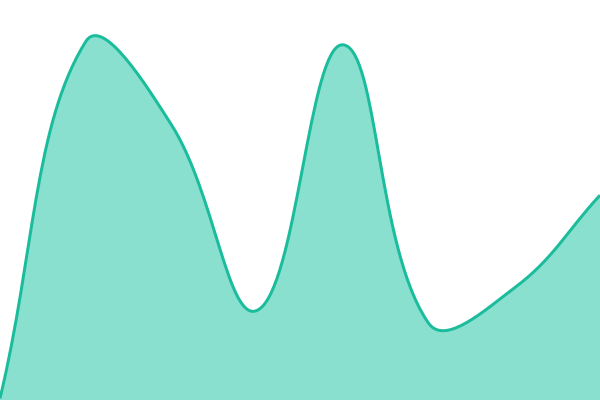
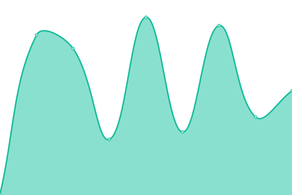

# [📈 Live Status](https://upptime.github.io/upptime): <!--live status--> **🟧 Partial outage**

This repository contains the open-source uptime monitor and status page for [Upptime](https://upptime.js.org), powered by [Upptime](https://github.com/upptime/upptime).

With [Upptime](https://upptime.js.org), you can get your own unlimited and free uptime monitor and status page, powered entirely by a GitHub repository. We use [Issues](https://github.com/upptime/upptime/issues) as incident reports, [Actions](https://github.com/sraaronrock/upptime/actions) as uptime monitors, and [Pages](https://upptime.github.io/upptime) for the status page.

<!--start: status pages-->
<!-- This summary is generated by Upptime (https://github.com/upptime/upptime) -->
<!-- Do not edit this manually, your changes will be overwritten -->
<!-- prettier-ignore -->
| URL | Status | History | Response Time | Uptime |
| --- | ------ | ------- | ------------- | ------ |
|  [Google](https://www.google.com) | 🟩 Up | [google.yml](https://github.com/sraaronrock/upptime/commits/HEAD/history/google.yml) | 

 140ms
     
 | 

<a href="https://uptime.sraaronrock.ovh/history/google">99.77%</a>
    

|  [Bing](https://www.bing.com) | 🟩 Up | [bing.yml](https://github.com/sraaronrock/upptime/commits/HEAD/history/bing.yml) | 

 178ms
     
 | 

<a href="https://uptime.sraaronrock.ovh/history/bing">100.00%</a>
    

|  [Hyspania](https://hyspania.net) | 🟥 Down | [hyspania.yml](https://github.com/sraaronrock/upptime/commits/HEAD/history/hyspania.yml) | 

 129ms
     
 | 

<a href="https://uptime.sraaronrock.ovh/history/hyspania">100.00%</a>
    

|  [Sraaronrock](https://sraaronrock.ovh) | 🟥 Down | [sraaronrock.yml](https://github.com/sraaronrock/upptime/commits/HEAD/history/sraaronrock.yml) | 

 124ms
     
 | 

<a href="https://uptime.sraaronrock.ovh/history/sraaronrock">100.00%</a>
    

|  [ProtonCorp](https://proton.me) | 🟩 Up | [proton-corp.yml](https://github.com/sraaronrock/upptime/commits/HEAD/history/proton-corp.yml) | 

 1152ms
     
 | 

<a href="https://uptime.sraaronrock.ovh/history/proton-corp">100.00%</a>
    

|  [NextDNS](https://nextdns.io) | 🟩 Up | [next-dns.yml](https://github.com/sraaronrock/upptime/commits/HEAD/history/next-dns.yml) | 

 242ms
     
 | 

<a href="https://uptime.sraaronrock.ovh/history/next-dns">100.00%</a>
    

|  [Tailscale](https://tailscale.com) | 🟩 Up | [tailscale.yml](https://github.com/sraaronrock/upptime/commits/HEAD/history/tailscale.yml) | 

 267ms
     
 | 

<a href="https://uptime.sraaronrock.ovh/history/tailscale">100.00%</a>
    

<!--end: status pages-->

[**Visit our status website →**](https://uptime.sraaronrock.ovh/)

## 📄 License

- Powered by: [Upptime](https://github.com/upptime/upptime)
- Code: [MIT](./LICENSE) © [Upptime](https://upptime.js.org)
- Data in the `./history` directory: [Open Database License](https://opendatacommons.org/licenses/odbl/1-0/)
