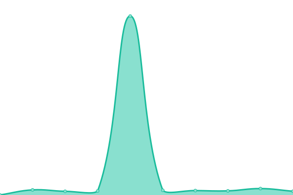

# [📈 Live Status](https://upptime.github.io/upptime): <!--live status--> **🟩 All systems operational**

This repository contains the open-source uptime monitor and status page for [Upptime](https://upptime.js.org), powered by [Upptime](https://github.com/upptime/upptime).

With [Upptime](https://upptime.js.org), you can get your own unlimited and free uptime monitor and status page, powered entirely by a GitHub repository. We use [Issues](https://github.com/upptime/upptime/issues) as incident reports, [Actions](https://github.com/sraaronrock/upptime/actions) as uptime monitors, and [Pages](https://upptime.github.io/upptime) for the status page.

<!--start: status pages-->
<!-- This summary is generated by Upptime (https://github.com/upptime/upptime) -->
<!-- Do not edit this manually, your changes will be overwritten -->
<!-- prettier-ignore -->
| URL | Status | History | Response Time | Uptime |
| --- | ------ | ------- | ------------- | ------ |
|  [Google](https://www.google.com) | 🟩 Up | [google.yml](https://github.com/sraaronrock/upptime/commits/HEAD/history/google.yml) | 

 154ms
     
 | 

<a href="https://uptime.sraaronrock.ovh/history/google">100.00%</a>
    

|  [MetaGer](https://metager.org) | 🟩 Up | [meta-ger.yml](https://github.com/sraaronrock/upptime/commits/HEAD/history/meta-ger.yml) | 

 915ms
     
 | 

<a href="https://uptime.sraaronrock.ovh/history/meta-ger">100.00%</a>
    

|  [DucoDog](https://www.ducodog.es) | 🟩 Up | [duco-dog.yml](https://github.com/sraaronrock/upptime/commits/HEAD/history/duco-dog.yml) | 

 439ms
     
 | 

<a href="https://uptime.sraaronrock.ovh/history/duco-dog">100.00%</a>
    

|  [ProtonMail](https://proton.me) | 🟩 Up | [proton-mail.yml](https://github.com/sraaronrock/upptime/commits/HEAD/history/proton-mail.yml) | 

 820ms
     
 | 

<a href="https://uptime.sraaronrock.ovh/history/proton-mail">100.00%</a>
    

|  [ForPlayers](https://wiki.fpcomunidad.com/) | 🟩 Up | [for-players.yml](https://github.com/sraaronrock/upptime/commits/HEAD/history/for-players.yml) | 

 212ms
     
 | 

<a href="https://uptime.sraaronrock.ovh/history/for-players">100.00%</a>
    

<!--end: status pages-->

[**Visit our status website →**](https://uptime.sraaronrock.ovh/)

## 📄 License

- Powered by: [Upptime](https://github.com/upptime/upptime)
- Code: [MIT](./LICENSE) © [Upptime](https://upptime.js.org)
- Data in the `./history` directory: [Open Database License](https://opendatacommons.org/licenses/odbl/1-0/)
